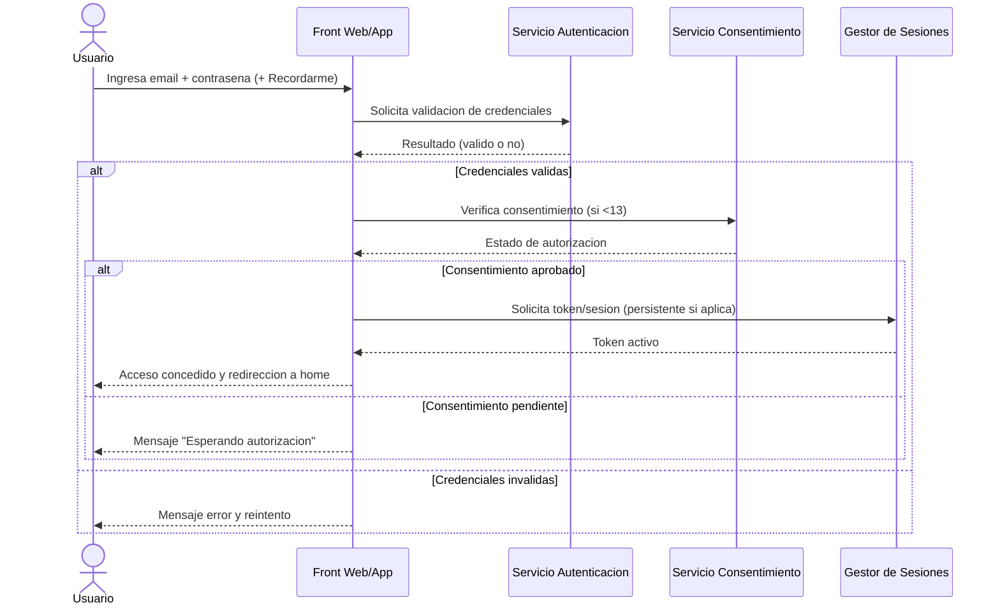
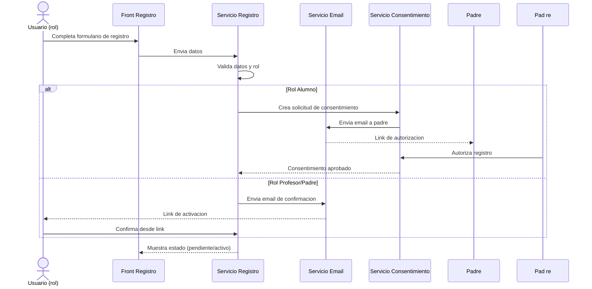
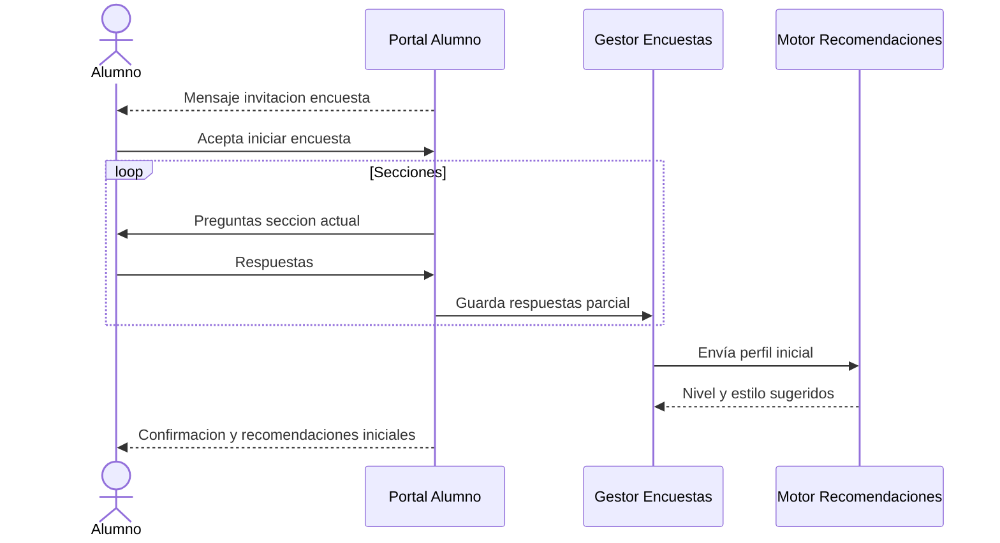
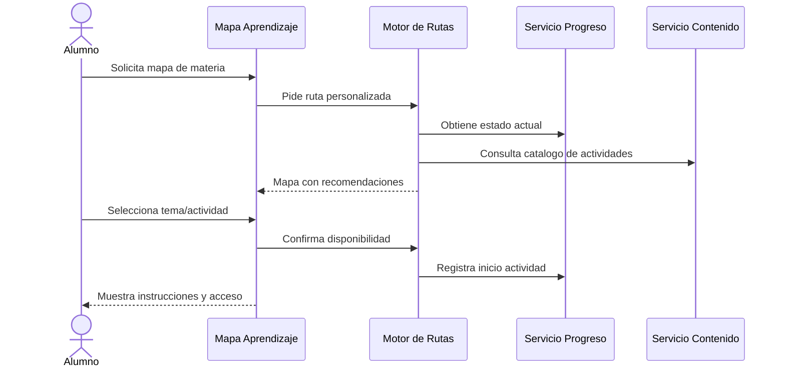
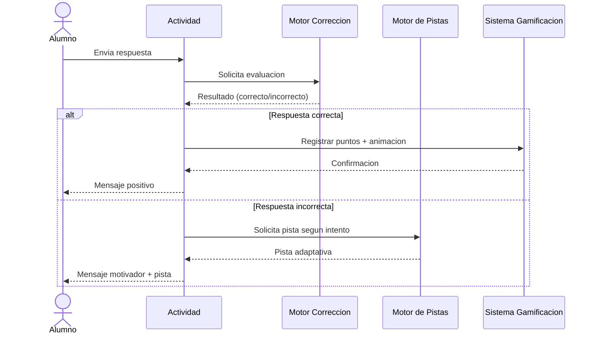
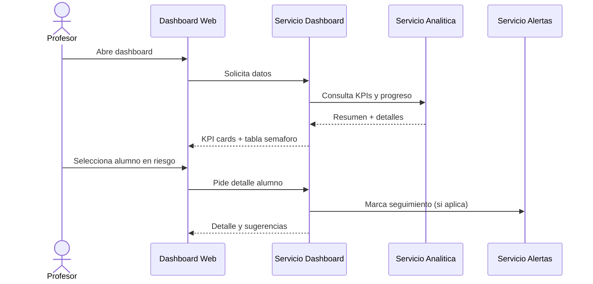
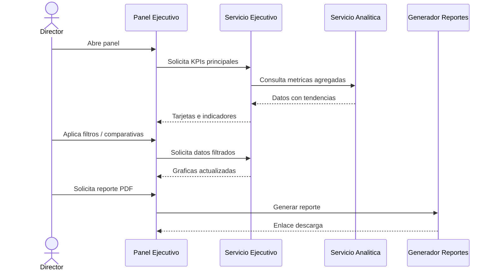
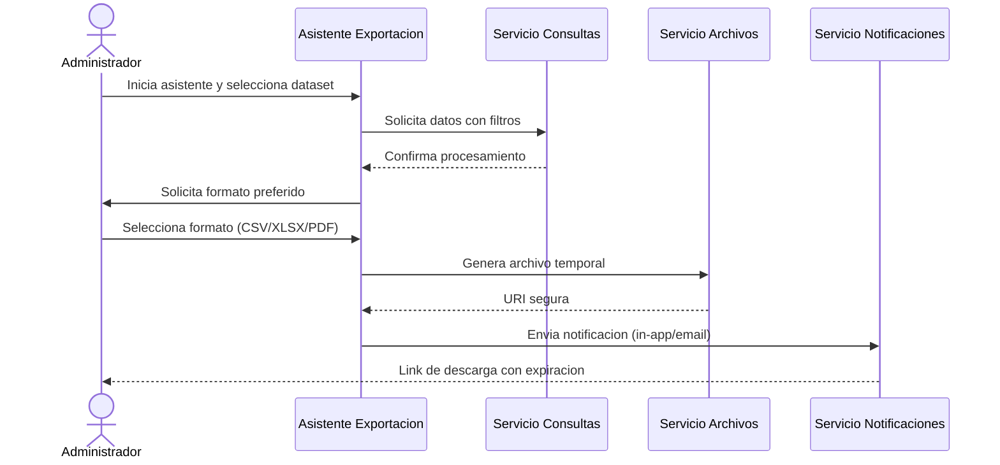

# Diagramas de Secuencia y ECUS de Historias de Usuario Simplificadas

Este documento resume los casos de uso esenciales (ECUS) y los diagramas de secuencia asociados para las ocho historias de usuario simplificadas. Cada sección incluye actores, condiciones, flujo principal, variaciones relevantes y la interacción visualizada mediante diagramas Mermaid.

---

## HU-001. Inicio de Sesion Seguro

### Especificacion del Caso de Uso

- **Actores:** Alumno/Profesor, Servicio de Autenticacion, Servicio de Consentimiento Parental, Sistema de Sesiones.
- **Objetivo:** Permitir que el usuario acceda de forma segura a la plataforma respetando COPPA y recordando la sesion si se solicita.
- **Precondiciones:** El usuario tiene credenciales registradas; para alumnos menores de 13 años existe registro parental pendiente o aprobado.
- **Postcondiciones:** Usuario autenticado y redirigido a su home con la sesion activa; en caso de menor sin consentimiento se bloquea el acceso y se notifica.
- **Flujo principal:**
  1. El usuario ingresa email y contrasena y selecciona "Recordarme" opcional.
  2. El sistema valida credenciales con el Servicio de Autenticacion.
  3. Si el usuario es menor de 13 anos, se consulta el estado de consentimiento parental.
  4. Con credenciales correctas y consentimiento vigente, se crea la sesion y se genera token persistente (si aplica) en el Servicio de Sesiones.
  5. El usuario es dirigido a su pantalla principal.
- **Variaciones y excepciones:**
  - Credenciales invalidas: se muestra mensaje y se registra intento fallido.
  - Consentimiento pendiente: se bloquea acceso y se indica "Esperando autorizacion".
  - Sesion expirada por inactividad: se solicita reautenticacion.

### Diagrama de Secuencia

---

## HU-002. Registro de Nuevos Usuarios

### Especificacion del Caso de Uso

- **Actores:** Nuevo Usuario (Profesor/Alumno/Padre), Servicio de Registro, Servicio de Email, Servicio de Consentimiento Parental.
- **Objetivo:** Permitir la creacion de cuentas para todos los roles cumpliendo verificaciones necesarias.
- **Precondiciones:** El usuario tiene acceso a un email valido; la plataforma esta disponible.
- **Postcondiciones:** Cuenta creada en estado "pendiente" o "activa" segun rol y verificaciones; se envian correos de confirmacion.
- **Flujo principal:**
  1. El usuario selecciona su rol y completa el formulario.
  2. El Servicio de Registro valida formato de datos y unicidad de email.
  3. Se crea la cuenta en estado correspondiente (activar via email o via consentimiento).
  4. Se dispara correo de confirmacion/activacion.
  5. El usuario sigue el enlace y la cuenta pasa a estado "activa".
- **Variaciones:**
  - Alumno 8-12 anos: se crea registro pendiente y se manda enlace al padre; el alumno ve mensaje de espera.
  - Padre/tutor: tras confirmar email, queda activo para autorizar registros.
  - Validacion anti-bot: si falla captcha se rechaza la solicitud.

### Diagrama de Secuencia

---

## HU-003. Encuesta Inicial del Alumno

### Especificacion del Caso de Uso

- **Actores:** Alumno, Gestor de Encuestas, Motor de Recomendaciones.
- **Objetivo:** Capturar preferencias y nivel inicial para personalizar futuras rutas.
- **Precondiciones:** Alumno recientemente registrado e identificado; encuesta disponible.
- **Postcondiciones:** Respuestas almacenadas y perfil inicial evaluado.
- **Flujo principal:**
  1. Al primer inicio el sistema invita al alumno a completar la encuesta.
  2. El alumno elige realizarla y se muestran secciones amigables.
  3. El Gestor de Encuestas registra cada respuesta.
  4. Al finalizar, se envian los resultados al Motor de Recomendaciones.
  5. Se confirma al alumno que su perfil esta listo y puede continuar.
- **Variaciones:**
  - Si el alumno pospone la encuesta, se agenda recordatorio y se habilita acceso desde el perfil.
  - La encuesta puede retomarse donde se dejo.

### Diagrama de Secuencia

---

## HU-004. Ruta de Aprendizaje Personalizada

### Especificacion del Caso de Uso

- **Actores:** Alumno, Motor de Rutas, Servicio de Contenido, Servicio de Progreso.
- **Objetivo:** Presentar un mapa visual con actividades adaptadas segun el nivel y el progreso.
- **Precondiciones:** Alumno con perfil inicial calculado; existe contenido etiquetado por nivel.
- **Postcondiciones:** Ruta mostrada, actividad seleccionada y estado actualizado.
- **Flujo principal:**
  1. El alumno abre una materia y solicita ver su mapa.
  2. El Motor de Rutas consulta progreso y perfil.
  3. Se construye el mapa con estaciones (completadas, actual, bloqueadas).
  4. El alumno selecciona un tema; el sistema sugiere actividades.
  5. Al elegir una actividad se registra el inicio en el Servicio de Progreso.
- **Variaciones:**
  - Si se detecta estancamiento, se insertan actividades de refuerzo.
  - Si el alumno elige una actividad mas avanzada, se verifica si cumple requisitos antes de desbloquearla.

### Diagrama de Secuencia

---

## HU-005. Retroalimentacion Inteligente para Alumnos

### Especificacion del Caso de Uso

- **Actores:** Alumno, Motor de Correccion, Motor de Pistas, Sistema de Gamificacion.
- **Objetivo:** Entregar feedback inmediato, motivador y adaptativo tras cada intento.
- **Precondiciones:** Alumno ejecutando una actividad interactiva.
- **Postcondiciones:** Intento registrado con retroalimentacion asociada; posibles puntos otorgados.
- **Flujo principal:**
  1. El alumno responde un ejercicio.
  2. El Motor de Correccion evalua si es correcto.
  3. Si es correcto, se dispara gamificacion (puntos, animacion).
  4. Si es incorrecto, el Motor de Pistas genera sugerencias progresivas.
  5. Se invita al alumno a reintentar hasta agotar oportunidades o completar.
- **Variaciones:**
  - Tras multiples fallos se ofrece pista mas explicita o se sugiere repasar.
  - En modo adaptativo se reduce dificultad temporalmente si persisten errores.

### Diagrama de Secuencia

---

## HU-006. Dashboard de Profesores

### Especificacion del Caso de Uso

- **Actores:** Profesor, Servicio Dashboard, Servicio Analitica, Servicio Alertas.
- **Objetivo:** Mostrar en una sola vista el estado del grupo y permitir profundizar en cada alumno.
- **Precondiciones:** Profesor con grupos asignados; datos de progreso sincronizados.
- **Postcondiciones:** Indicadores mostrados; acciones potenciales registradas.
- **Flujo principal:**
  1. El profesor accede al dashboard.
  2. El Servicio Dashboard solicita KPIs al Servicio de Analitica.
  3. Se renderiza la vista general con tarjetas, tabla y semaforos.
  4. El profesor filtra o selecciona un alumno especifico.
  5. Se muestran detalles y recomendaciones accionables; si detecta riesgo, se genera alerta.
- **Variaciones:**
  - Las alertas criticas se muestran prioritariamente.
  - Puede exportar resumen rapido hacia tareas de seguimiento.

### Diagrama de Secuencia

---

## HU-007. Dashboard Ejecutivo

### Especificacion del Caso de Uso

- **Actores:** Director/Coordinador, Servicio Ejecutivo, Servicio Analitica, Generador de Reportes.
- **Objetivo:** Proveer indicadores institucionales y comparativas historicas.
- **Precondiciones:** Datos agregados de escuelas, grupos y periodos cargados en el data mart.
- **Postcondiciones:** Director visualiza KPIs y puede descargar reportes ejecutivos.
- **Flujo principal:**
  1. El director ingresa al panel ejecutivo.
  2. El Servicio Ejecutivo consulta al motor analitico por KPIs globales.
  3. Se muestran tarjetas con adopcion, progreso, retencion, etc.
  4. El director filtra por periodo o region y solicita tendencias.
  5. Opcionalmente, genera un reporte PDF para presentaciones.
- **Variaciones:**
  - Puede comparar periodos (mes vs mes anterior).
  - Se resaltan alertas institucionales (caidas de uso).

### Diagrama de Secuencia

---

## HU-008. Exportacion de Datos

### Especificacion del Caso de Uso

- **Actores:** Administrador/Coordinador, Asistente de Exportacion, Servicio de Consultas, Servicio de Archivos Temporales, Servicio de Notificaciones.
- **Objetivo:** Permitir descargar datos en formatos estandar de manera segura y filtrada.
- **Precondiciones:** Usuario con permisos de exportacion; datasets disponibles en el data warehouse.
- **Postcondiciones:** Se genera archivo solicitado y se entrega enlace temporal o descarga directa.
- **Flujo principal:**
  1. El usuario inicia el asistente y selecciona el tipo de datos.
  2. Define el periodo y filtros deseados.
  3. Elige formato de salida (CSV, XLSX, PDF).
  4. El Servicio de Consultas arma el dataset y lo entrega al Servicio de Archivos.
  5. Se notifica al usuario cuando el archivo esta listo para descargar.
- **Variaciones:**
  - Para exportaciones extensas, el proceso queda en segundo plano y se notifica por email.
  - Los enlaces expiran tras cierto tiempo para seguridad.

### Diagrama de Secuencia

