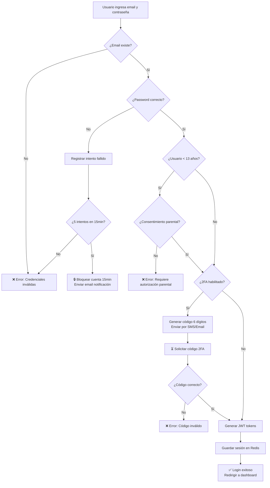
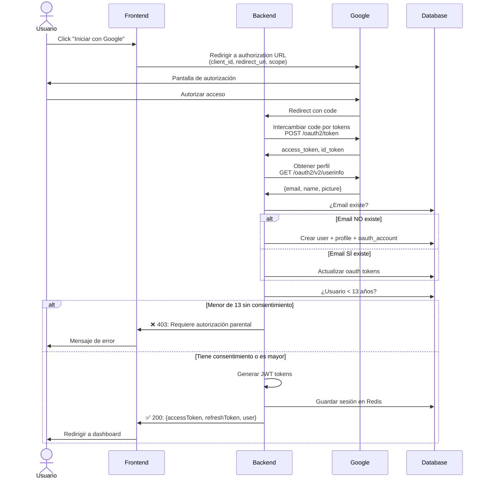
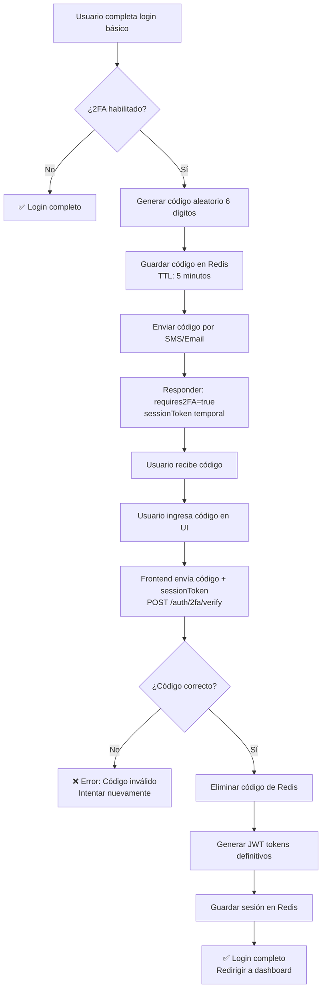
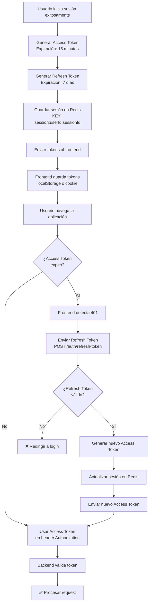
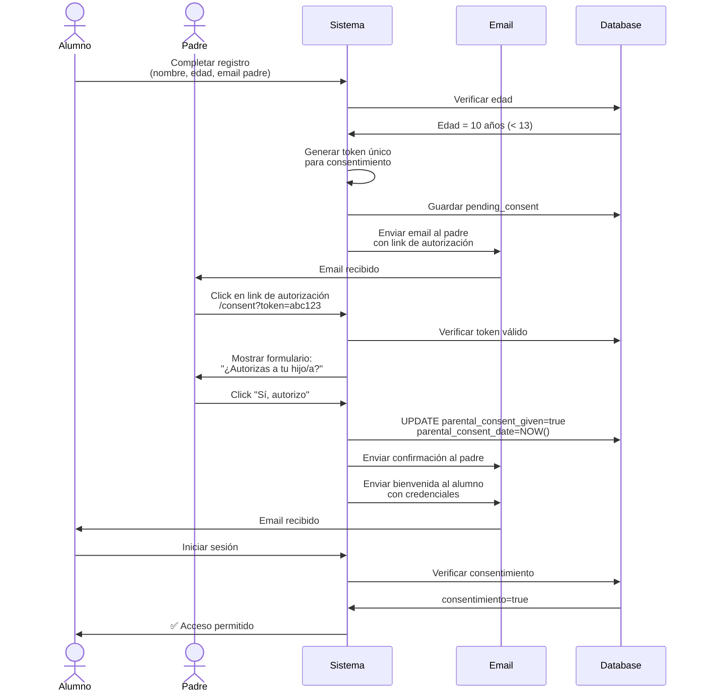

# Diagramas de Flujo - Sistema de Login

## 📋 Referencia

**Historia de Usuario**: HU-001 - Inicio de Sesión Seguro

---

## 📊 Diagrama 1: Login con Email y Contraseña



---

## 📊 Diagrama 2: Login con OAuth (Google)



---

## 📊 Diagrama 3: Verificación 2FA



---

## 📊 Diagrama 4: Manejo de Sesiones



---

## 📊 Diagrama 5: Flujo COPPA (Consentimiento Parental)



---

## 📊 Diagrama 6: Bloqueo por Intentos Fallidos

```mermaid
flowchart TD
    A[Usuario intenta login] --> B[Verificar password]
    B --> C{¿Correcto?}
    C -->|Sí| D[✅ Login exitoso<br>Resetear contador]
    C -->|No| E[Registrar en login_attempts<br>success=false]
    E --> F[Contar intentos fallidos<br>últimos 15 minutos]
    F --> G{¿≥ 5 intentos?}
    G -->|No| H[❌ Mostrar error<br>Indicar intentos restantes]
    G -->|Sí| I[Calcular timestamp<br>unlock_at = NOW + 15min]
    I --> J[Guardar bloqueo en Redis<br>KEY: locked:email<br>TTL: 900 segundos]
    J --> K[Enviar email notificación:<br>"Cuenta bloqueada temporalmente"]
    K --> L[❌ Responder 429:<br>"Demasiados intentos.<br>Inténtalo en 15 minutos"]
    L --> M[Usuario espera...]
    M --> N[Después de 15 min:<br>Redis TTL expira]
    N --> O[Usuario puede intentar nuevamente]
```

---

## 🎨 Leyenda de Símbolos

- ✅ = Operación exitosa
- ❌ = Error o rechazo
- 🔒 = Bloqueo de seguridad
- ⏳ = Proceso en espera
- 💾 = Operación de base de datos
- 📧 = Envío de email
- 🔑 = Generación de token/código

---

**Última actualización**: 09/11/2025
